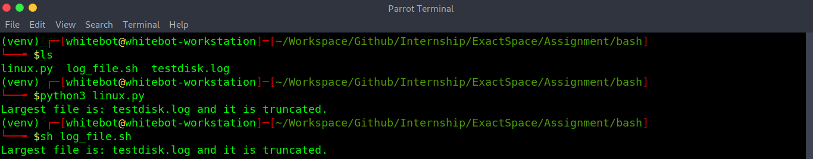

# ML Ops Internship Assessment


### Problem statement 1: Bash

- Find the largest log file (.log) in a directory and truncate it to 100 lines if it contains more than 100 lines

#### Bash
```bash
git clone https://github.com/fxrarz/Internship.git
cd ExactSpace/bash/
```

#### Run
```bash
python3 linux.py
sh ./log_file.sh
```

<div align="center">
 
</div>

<br>

### Problem statement 2: Rest-API UI integration

- Build an API server which accepts JSON as an input.
- Build a front-end UI that has a textarea and a submit button.

#### Rest-API
```bash
git clone https://github.com/fxrarz/Internship.git
cd ExactSpace/
pip install -r requirements.txt
```

#### Run
```bash
cd restful-api/
python3 run_server.py
```
- [webapp](http://127.0.0.1:5000) 

<div align="center">
 
</div>

