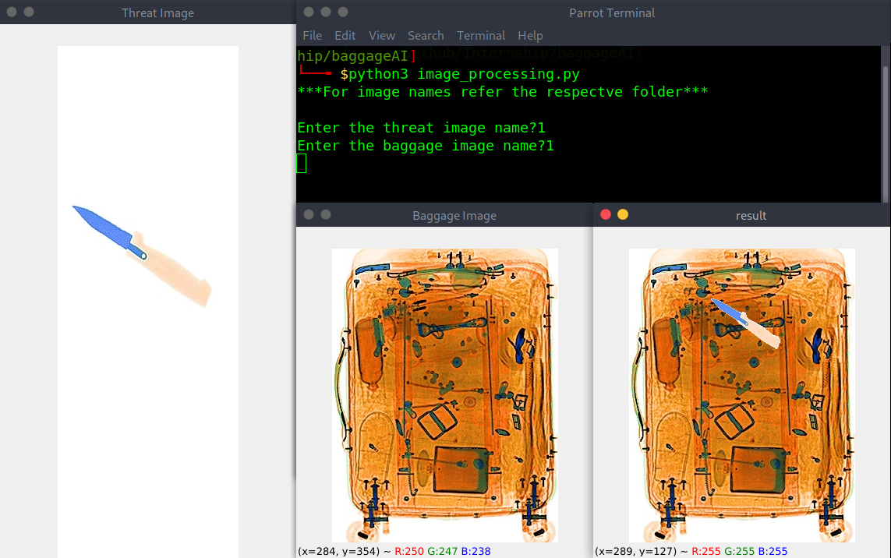
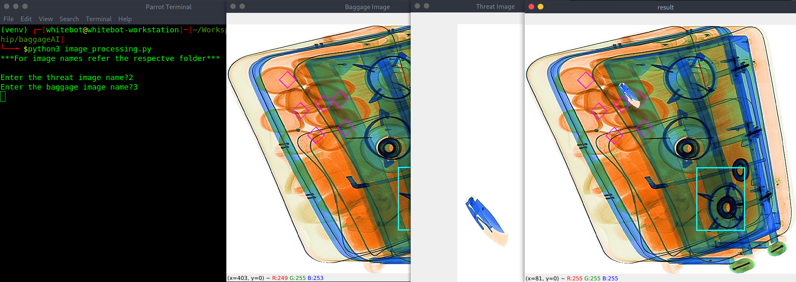

# BaggageAI Computer Vision Assignment


Problem statement: Image Processing

Two sets of images are given :- background and threat objects. Background images are the
background x-ray images of baggage that gets generated after passing through a X-ray machine at
airport. Threat images are the x-ray images of threats that are prohibited at airport while travelling.

- cut the threat objects, scale it down, rotate with 45 degree and paste it into the background images using image processing techniques in python

- Threat objects should be translucent, means it should not look like that it is cut pasted. It should look like that the threat was already there in the background images. Translucent means the threat objects should have shades of background where it is pasted.

- Threat should not go outside the boundary of the baggage. **difficult**

- If there is any background of threat objects, then it should not be cut pasted into the background images, which means while cutting the threat objects, the boundary of a threat object should be tight-bound.


### Getting Started
```bash
git clone https://github.com/fxrarz/Internship.git
cd baggageAI
```

### Run
```bash
python3 image_processing.py
```

### Sample 1
- Threat Image : 1
- Baggage Image: 1
<div align="center">
 
</div>


### Sample 2
- Threat Image : 2
- Baggage Image: 3
<div align="center">
 
</div>